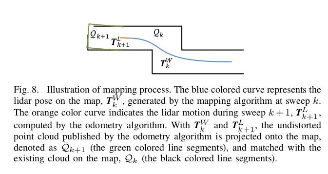
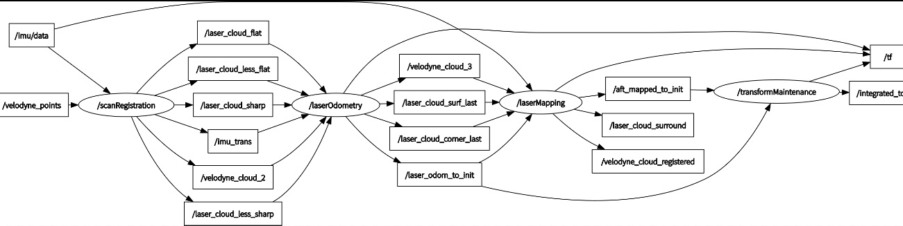
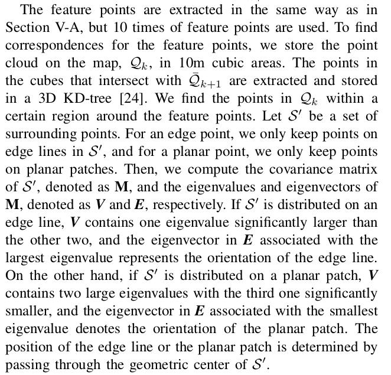

LaserMapping源码分析
=========================================
先来梳理一下：点云数据进来后，经过前两个节点的处理可以完成一个完整但粗糙的视觉里程计，可以概略地估计出Lidar的相对运动。如果不受任何测量噪声的影响，这个运动估计的结果足够精确，没有任何漂移，那我们可以直接利用估计的Lidar位姿和对应时刻的量测值完成建图。但这就如同现实中不存在一个不受外力就能匀速直线运动的小球一样，量测噪声是不可避免的，因此Lidar位姿估计偏差一定存在。（有兴趣的读者可以试一试，直接拿这两个节点的结果在rviz里显示一下，能不能分辨的出这一块仅仅依靠位姿估计拼接起来的点云是否正确）回过头来说说这个节点的代码。
概述
为了搞懂这部分内容，首先有两个问题需要明确：
1.为什么要有这个建图节点？
2.建图节点又到底起了什么作用？
第一个问题：为什么要有建图节点。正如我们刚才所说，Lidar里程计的结果不准确，拼起来的点也完全不成样子，且它会不断发散，因此误差也会越来越大。试想一下我们对特征的提取仅仅只是关注了他们的曲率，这种方式怎么可能完美的得到两帧点云准确的配准点。且点云中的点是离散的，我们也无法保证上一帧的点在下一帧中仍会被扫到。总之，无论我们多努力想让Lidar里程计的估计结果变得精准，残酷且冰冷的显示都会把我们的幻想击碎。因此，我们需要依靠别的方式去优化Lidar里程计的位姿估计精度。在SLAM领域，一般会采用与地图匹配的方式来优化这一结果。其实道理也很简单，我们始终认为后一时刻的观测较前一时刻带有更多的误差，换而言之，我们更加信任前一时刻结果。这就是回归到贝叶斯估计那一套东西了。因此我们对已经构建地图的信任程度远高于临帧点云配准后的Lidar运动估计。所以我们可以利用已构建地图对位姿估计结果进行修正。
第二个问题：建图节点起到了什么作用？在回答上一个问题时也已经提到了，它的作用就是优化Lidar里程计的位姿估计结果。怎么做呢？没错，就是利用地图。试想一下，你在得到第一帧点云时你的lidar就扫到了数万个点，此时Lidar的位置我们把它作为（0,0,0），在不考虑测量噪声的情况下这数万个点都是相对精确的，我们把这数万个点所构成的环境作为此时的地图。而后Lidar运动了一小段，我们通过Lidar里程计的方法估算了它的相对运动，于是就可以将此时的Lidar位姿及此时的点按照我们估计的相对运动情况，转换到上一时刻（建立地图时的坐标系）的坐标系下。只不过由于里程计估计误差，地图可能拼歪了。既然这样，如果把之前的地图也进行匹配，是不是就可以优化此时Lidar的位姿了呢？这就是建图节点起到的关键作用。只不过拿当前扫描的点云和地图中所有点云去配准，这个计算消耗太大，因此为了保证实时性，作者在这里采用了一种低频处理方法，即调用建图节点的频率仅为调用里程计节点频率的十分之一。
有了这个整体的思路，我们就可以来看看具体是怎么做的,

接着看看输入输出：

lasermapping节点main函数的套路和之前类似：

.. literalinclude:: ../../../src/laser_mapping_node.cpp
  :lines: 5-20

setup()完成参数初始化，topic订阅和发布。spin()函数启动回调，同时调用process()进行处理。
重点看process()函数，大致步骤分为2步，1.坐标转换 

.. literalinclude:: ../../../src/lib/LaserMapping.cpp
  :lines: 496-529

2.优化处理,先看看论文介绍：

先把之前的点云保存在10m*10m*10m的立方体中，若cube中的点与当前帧中的点云有重叠部分就把他们提取出来保存在KD树中。我们找地图中的点时，要在特征点附近宽为10cm的立方体邻域内搜索（实际代码中是10cm×10cm×5cm）。代码如下：

.. literalinclude:: ../../../src/lib/LaserMapping.cpp
  :lines: 62-69

而后我们就要找当前估计的Lidar位姿属于哪个子cube。I、J、K对应了cube的索引。可以看出，当坐标属于[-25,25]时，cube对应与(10,5,10)即正中心的那个cube。

.. literalinclude:: ../../../src/lib/LaserMapping.cpp
  :lines: 532-559

后面类似，处理完毕边沿点，接下来就是在取到的子cube的5*5*5的邻域内找对应的配准点了。

.. literalinclude:: ../../../src/lib/LaserMapping.cpp
  :lines: 636-685

这里还需要判断一下该点是否属于当前Lidar的可视范围内，可以根据余弦公式对距离范围进行推导。根据代码中的式子，只要点在x轴±60°的范围内都认为是FOV中的点(作者这么做是因为Lidar里程计的估计结果太不准确了，只能概略的取一个较大的范围)。于是我们就得到了在当前Lidar位置的邻域内有效的地图特征点。我们就不需要对庞大的所有地图点云进行处理了，只需要处理这些邻域cube内的地图特征点即可，可以节省大量的运算资源。为了保证当前帧的点云足够平滑，还对点云进行了滤波处理。

.. literalinclude:: ../../../src/lib/LaserMapping.cpp
  :lines: 686-718

做完这些工作以后，我们就有了在当前Lidar所在位置附近的所有地图特征点以及当前帧的点云特征点，后面的工作就是怎么把这两块点匹配在一起！于是再次拿出KD树，来寻找最邻近的5个点。对点云协方差矩阵进行主成分分析：若这五个点分布在直线上，协方差矩阵的特征值包含一个元素显著大于其余两个，与该特征值相关的特征向量表示所处直线的方向；若这五个点分布在平面上，协方差矩阵的特征值存在一个显著小的元素，与该特征值相关的特征向量表示所处平面的法线方向。因此我们可以很轻易的根据特征向量找到直线上两点从而利用论文中点到直线的距离公式构建优化问题。平面特征也是相同的思路。完成了优化问题的构建之后就可以对它进行求解了，求解方法还是L-M迭代。这部分代码与laserOdometry部分的几乎一致。

.. literalinclude:: ../../../src/lib/LaserMapping.cpp
  :lines: 789-1026

截止到这里，我们就完成了当前帧点云与地图点云的配准，并对Lidar里程计的运动估计结果进行完了优化。更新完成后，我们还需要将当前帧扫描得到的特征点云封装在不同的cube中，并在地图数组中保存。最后就是将各种信息发布出去了。这里需要说明的是，为了保证运行效率环境点云每5帧发布一次。

