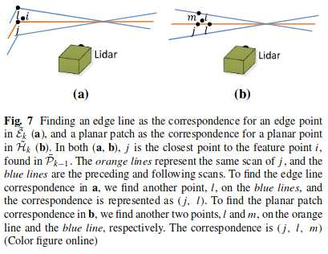
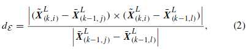
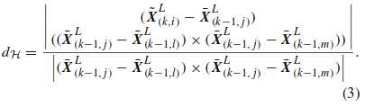
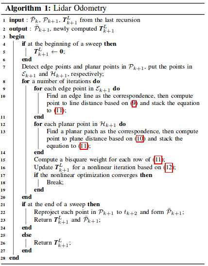

LaserOdometry源码分析
=========================================

这篇文章将对该系统的第二大部分laserOdometry进行深入的解读，其中会有一些公式的推到和一些关于L-M求解最小二乘的方法，不太了解的同学可以先自行学习一下。

dar的相对运动关系。我们先回顾一下scanRegistration的工作。它让我们获得了各种特征的点云，那配准工作就可以很简单的进行了：我们利用scanRegistration分别获得t时刻和t+1时刻点云中的特征点，然后建立这两部分点云的一一对应关系，配准工作不就完成了！听起来很简单的样子。

但是一看代码就蒙圈了...这个main函数可真不是一般的长，咋啥东西都扔进来了，封装成一些函数或是类不好吗......

为了学习loam的精髓，就是刀山火海也得上啊！还是先来看看代码。

main函数前面这么多行，其实都只是ros节点的“套路”（可以看做代码的写作模板），作用是告诉节点要订阅哪些消息，用什么回调函数处理这些消息，节点要发布什么消息。订阅器subCornerPointsSharp、subCornerPointsLessSharp、subSurfPointsFlat、subSurfPointLessFlat、subLaserCloudFullRes、subImuTrans分别订阅scanRegistration节点发布的/laser_cloud_sharp、/laser_cloud_less_sharp、pubSurfPointFlat、pubSurfPointLessFlat、/velodyne_cloud_2、/imu_trans消息，并分别调用回调函数laserCloudSharpHandler、laserCloudLessSharpHandler、laserCloudFlatHandler、laserCloudLessFlatHandler、laserCloudFullResHandler、imuTransHandler处理这些边特征、面特征、全部点云和IMU数据，把他们从ROS::Msg类型转换成程序可以处理的pcl点云类型；发布器pubLaserCloudCornerLast、pubLaserCloudSurfLast、pubLaserCloudFullRes、pubLaserOdometry分别发布/laser_cloud_corner_last、/laser_cloud_surf_last、/velodyne_cloud_3、/laser_odom_to_init消息。其中/laser_odom_to_init消息的发布频率高，其余三个消息每接收到三次scanRegistration节点的消息才发布一次。

如果我们订阅到了scanRegistration节点发布的消息，那么就可以开始宏伟的计算处理工作了！计算过程分为三步：初始化、点云处理、坐标转换。下面一步一步来看：

1. 初始化

   计算前来个热身，做一步初始化的工作。

   为什么要初始化呢？因为如果你只有一坨t时刻的点云去哪跟人配准去啊。所以如果只有一坨点，就还是不要算了，等你带另一坨一起来的时候再愉快的计算吧。

   2. 点云配准与运动估计

   这部分是整个laserOdometry节点的重中之重。假设你现在已经得到了两坨点云，对他们进行处理之前你首先得保证这些特征点足够多，否则你带了两坨没有任何特征的点，那可就真的爱莫能助了，用程序表达就是设定一个阈值进行判断。

   在点云足够多的条件下，终于要开始正式工作了。这里我们设定整个L-M运动估计的迭代次数为25次，以保证运算效率。迭代部分又可分为：对特征边/面上的点进行处理，构建Jaccobian矩阵，L-M运动估计求解。

L-M方法其实就是非线性最小二乘，是Gauss-Newton优化的一种改进（增加了一个阻尼因子，代码中的s），所以关键在于如何把点云配准和运动估计的问题转换为L-M优化求解的问题。主要思路就是：构建约束方程 -> 约束方程求偏导构建Jaccobian矩阵 -> L-M求解。很简单吧！所以不要看代码有千八百行，但实际上也没那么复杂。下面再一步一步来看：关于构建约束方程的问题就是这节标题中提到的点云配准的问题，其基本思想就是从上一帧点云中找到一些边/面特征点，在当前帧点云中同样找这么一些点，建立他们之间的约束关系。

    特征边/面上的点配准

找t+1时刻的某个特征边/面上的点在t时刻下对应的配准点，论文作者给出如上图的思路。特征线：利用KD树找点i在t时刻点云中最近的一点j，并在j周围（上下几条线的范围内）找次近点l，于是我们把（j，l）称为点i在t时刻点云中的对应。特征面：与特征线类似，先找最近点j，在j周围找l，在j周围找m，将（j，l，m）称为点i在t时刻点云中的对应。代码实现如下：

特征线：

特正面：

这里需要指出的是：并不是每次运动估计完成一次迭代，就进行一次坐标转换，然后在整个点云范围内搜索其最近点。这里设定了一个5次的阈值，每五次搜索一次，以保证运行效率。

    构建Jaccobian矩阵

    我们之所以去找配准点，目的在于找到不同时刻的两坨点云间的约束关系。那么他们之间有什么约束关系呢？作者分别给了关于线和面的两个约束方程：

由于未作过多说明这两个约束看起来有一丝不友好，到底是如何推导的呢？先对变量进行说明： \tilde{X}_{(k,i)}^{L} 表示k时刻在坐标系L下的点i。所以我们在上一节中找到的线的配准点（j，l）就是 \tilde{X}_{(k-1,j)}^{L} 和 \tilde{X}_{(k-1,l)}^{L} 。下面上个粗糙的手画图各位看官凑合看一下（哈哈，懒得在电脑上画了）

公式(2)可由图中三角形inm与三角形ilp相似得到。由于 (\tilde{X}_{(k,i)}^{L}-\tilde{X}_{(k-1,j)}^{L})和 (\tilde{X}_{(k,i)}^{L}-\tilde{X}_{(k-1,l)}^{L}) 的外积，实际就乘上一个两向量夹角的正弦值，则向量 (\tilde{X}_{(k,i)}^{L}-\tilde{X}_{(k-1,j)}^{L}) 模的正弦值不就是mn的长嘛。则点i到直线lj的距离就可以由式(2)求得。

这里为了直观我从几何的角度推导了这个公式，当然也可以单纯从向量代数的角度推导。公式(3)可由类似方法推导，我就不赘述了。

根据公式(2)-(3)我们有了这两坨点云的约束方程，构建Jaccobian矩阵就非常简单了，直接对待估参数（ \tilde{X}_{(k,i)}^{L} ）求偏导就ok了。再看对应程序中如何实现偏导的：

特征线：

特征面：

至此Jaccobian矩阵就构建完毕了。每个特征点对应的Jaccobian矩阵的三个元素都保存在coeffSel中，后面采用L-M方法解算的时候直接调用就行了。

    L-M运动估计求解

    解算前首先要搞清楚要怎么表达Lidar的姿态，论文中给出公式：

我们认为Lidar匀速运动，因此公式(4)实现了Lidar变换矩阵的内插，得到其扫描点i时刻的位姿

公式(5)就是经典的刚体的旋转平移变换。

公式(6)为罗德里格斯公式，将旋转矩阵用旋转矢量表示，这种方法的最大优势在于节约计算所消耗的资源。

公式(7)-(8)分别为旋转矢量公式中的参数计算。搞清楚这些以后，就开始L-M的计算了;

这就是LM的解算过程，具体程序实现：

3. 坐标转换

   算出了两坨点云间的相对运动，但他们是在这两帧点云的局部坐标系下的，我们需要把它转换到世界坐标系下，因此需要进行转换。这部分内容较为简单，直接上代码了：

至此我们接完成了整个laserOdometry的计算，剩下的只需要把这些计算结果发布出去就好了。最后贴一张论文里这块内容的伪码图帮助大家更好的理解这块内容的一个框架：

