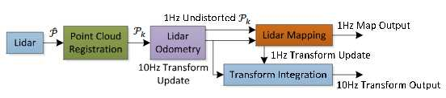

MultiScanRegistration源码分析
=========================================

.. Note::
   参考：http://wiki.ros.org/loam_velodyne

   https://github.com/laboshinl/loam_velodyne

   http://www.frc.ri.cmu.edu/~jizhang03/Publications/RSS_2014.pdf

LOAM 的整体思想就是将复杂的 SLAM 问题分为:1. 高频的运动估计;2. 低频(低一个数量级)的环境建图。整个系统的框架如图:

Lidar 接收数据,首先进行 Point Cloud Registration,Lidar Odometry 以 10Hz 的频率进行运动估计和坐标转换,Lidar Mapping 以 1Hz 的频率构建三维地图。这样做主要是为了保证系统的实时性。下面再来看看 rqt 节点图:

.. image:: ../images/node_graph.jpg
  :align: center

MultiScanRegistration 主要实现多种激光类型类,继承 ScanRegistration, 具体激光数据由 ScanRegis-tration 处理

.. literalinclude:: ../../../include/loam_velodyne/MultiScanRegistration.h
  :lines: 104 

组合类 MultiScanMapper, 实现激光配置, 包括垂直方向最低,最高角度,线数。

.. literalinclude:: ../../../include/loam_velodyne/MultiScanRegistration.h
  :lines: 135,57-59

节点调用逻辑, 首先 ros 节点初始化->MultiScanRegistration 对象初始化-> 调用 setup, 初始化激光配置,订阅激光数据,调用 ScanRegistration::setup 发布边特征点云,平面特征点云,抽取特征后的总点云,imu_trans-> 点云 callback() 调用 process() 为点云特征抽取做准备-> 调用 extractFeatures() 抽取点云特征-> 发布。后续几个节点调用逻辑类似:

.. literalinclude:: ../../../src/multi_scan_registration_node.cpp
  :lines: 5-20

重点介绍 process() 函数

.. literalinclude:: ../../../src/lib/MultiScanRegistration.cpp
  :lines: 157-255

接下来就交给 ScanRegistration 处理抽取边特征,平面特征, 函数 extractFeatures();

