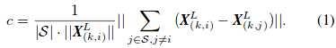
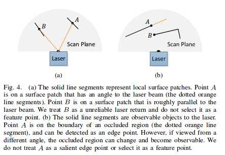

ScanRegistration源码分析
=========================================

这一节点主要功能实现点云特征点的配准。基本原理：就是根据点云中点的曲率c来将点划分为不同的类别（边/面特征或不是特征），公式如下：

（这里的实现和代码看起来有点不一致,具体实现计算点云中i点与周围10点的距离，求得曲率半径，曲率半径越大，曲率越小）：

刚才我们已经遍历所有点，根据角度计算结果将其划分为不同的线：计算角度-->计算起始和终止位置-->插入IMU数据-->将点插入容器中,最后更新总的点云laserCLoud
我们已经把一帧杂乱的点云数据有条理的放在了容器里，下面就可以开始处理啦！
我们要在laserCloud中找特征点的候选点，该怎么找呢？没错，就是最暴力的方法：遍历每个点（除了前五个和后五个），计算各点曲率并找到所有线的起点终点位置；
extractFeatures()具体代码实现：

.. literalinclude:: ../../../src/lib/ScanRegistration.cpp
  :lines: 330-369

最重要的是setScanBuffersFor()这个函数，实现曲率计算和排序

.. literalinclude:: ../../../src/lib/ScanRegistration.cpp
  :lines: 433-469

setRegionBuffersFor()函数实现特征挑选，参照论文对与点位筛选的条件：1. 平面/直线与激光近似平行的点不能要； 2. 被遮挡的边缘点不能要（(b)中点A右侧部分）

遍历所有点（除去前五个和后六个），判断该点及其周边点是否可以作为特征点位：当某点及其后点间的距离平方大于某阈值a（说明这两点有一定距离），且两向量夹角小于某阈值b时（夹角小就可能存在遮挡），将其一侧的临近6个点设为不可标记为特征点的点；若某点到其前后两点的距离均大于c倍的该点深度，则该点判定为不可标记特征点的点（入射角越小，点间距越大，即激光发射方向与投射到的平面越近似水平）。

.. literalinclude:: ../../../src/lib/ScanRegistration.cpp
  :lines: 472-516

现在我们得到了一组有条理的点云，且把那些与我们想提取的特征不符的点标记了出来，那我们只需要从剩下的点中选择最好的那一波不就行了！为了保证特征点均匀的分布在环境中，将一次扫描划分为4个独立的子区域，每个子区域最多提供2个边缘点和4个平面点。我们只需要预先设定好阈值，就可以轻松加随意的将这些点分类了。代码中，把每个线分为6段进行处理，每段都将曲率按照升序排列。看代码：

.. literalinclude:: ../../../src/lib/ScanRegistration.cpp
  :lines: 371-430

终于把这波特征点找到了，后面就是把他们简简单单地发布出去了。

