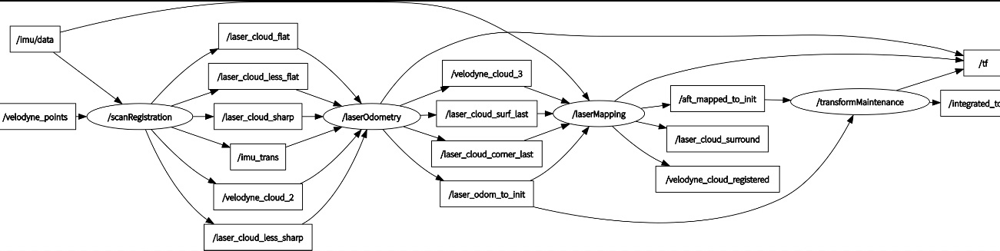

TransformMaintenance源码分析
=========================================
还是先看节点输入输出:

可以看到该节点订阅了 laserOdometry 节点发布的/laser_odom_to_init 消息(Lidar 里程计估计位姿到初始坐标系的变换)以及 laserMapping 节点发布的/aft_mapped_to_init 消息(laserMapping 节点优化后的位姿到初始坐标系的变换),经过节点处理发布/integrated_to_init 消息。所以要搞清楚这个transformMaintenance 节点到底是干嘛的,我们首先需要弄清楚它所发布的消息到底是什么含义。这个节点的主函数非常简单:

.. literalinclude:: ../../../src/transform_maintenance_node.cpp
   :lines: 5-20

可以看出/integrated_to_init 消息是由发布器 pubLaserOdometry2 发布的,顺藤摸瓜,发现每次接收到/laser_odom_to_init 消息并调用回调函数 laserOdometryHandler 时,就发布一次该消息。通过该回调函数可以看出,他完成的就是一个简单则坐标转换,得到经过 laserMapping 优化后的 Lidar 位姿。但是!!!这个节点接收了两个消息,分别是 laserOdometry 节点和 laserMapping 节点发布的,而这两个节点发布的频率不同啊!!看图可以知道,论文中说 1Hz 和 10Hz,实际是 5Hz 和 10Hz。所以这个/integrated_to_init消息到底是什么?实际它就是融合后的 Lidar 轨迹,说白了就是:有优化结果了就拿这一时刻的优化结果作为轨迹,没有优化结果只有里程计结果了,就直接拿里程计结果作为这一时刻的轨迹。

.. literalinclude:: ../../../src/lib/TransformMaintenance.cpp
  :lines: 180-213

